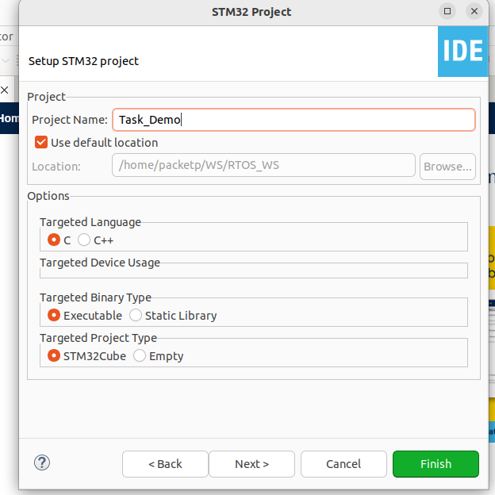
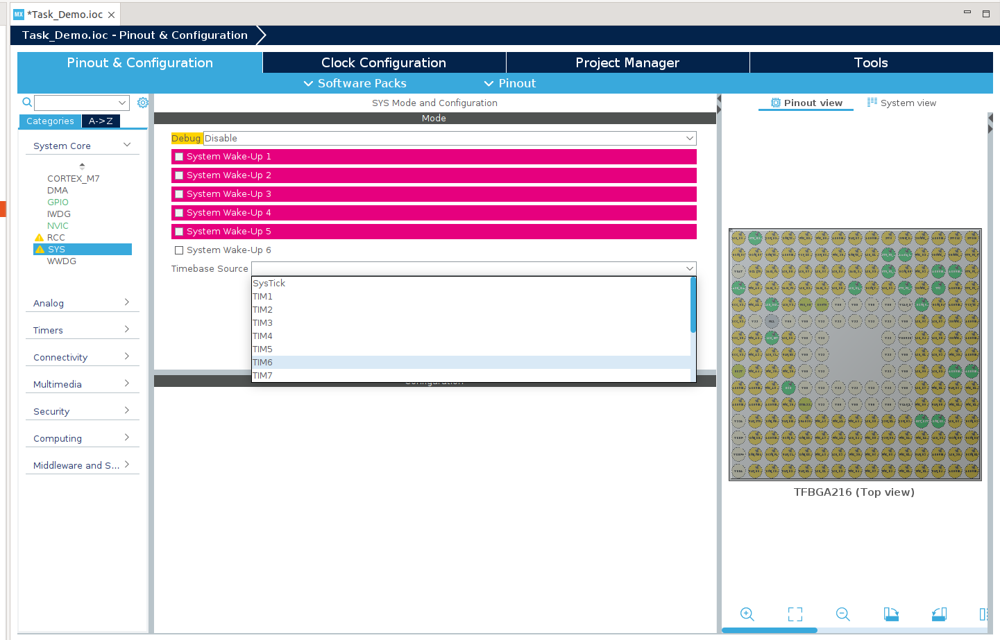

# FreeRTOS_Tasks
1. After running STM32CubeIDE, STM32CubeIDE Launcher appears as shown below:
   
2. After getting into "Information Center", please press "Start new STM32 project" button on the left:
   
   
3. Select "Board Selector" and type "F746G" in "Part Number Search" to quickly sort out the board we want. Click F746DISCOVERY in Board List and then press "Next" button:
   

4. Assign Project Name and suggest to keep "Use default location" checked, then press "Finish" button:
   

  Press "NO" for the following dialog:
   

5. In pin configuartion, select TIM6 for Timebase Source:
   

   Turn off the handlers like this:
   

   Generate the code by "Ctrl+s" or by pressing the device configuration tool in the top left corner below 'run'.
   

7. Add this task code in main.c b/w the /* USER CODE BEGIN 2 */ & /* USER CODE END 2 */
   

  Also add this code in main.c b/w the /* USER CODE BEGIN 4 */ & /* USER CODE END 4 */
   
   
8. To build the code :
   

  If build is succesfull, then the similar to following will be shown:
   

  Else there might be errors like this:
  

9. For Debugging:
  

  
   
